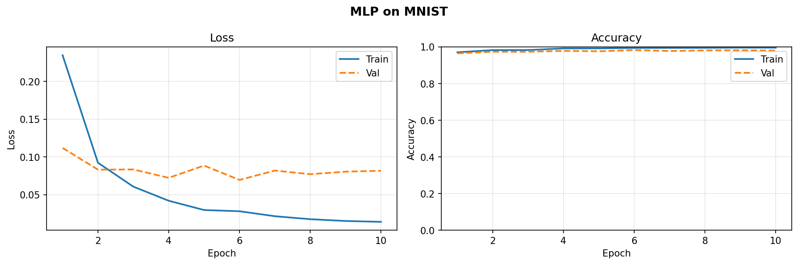
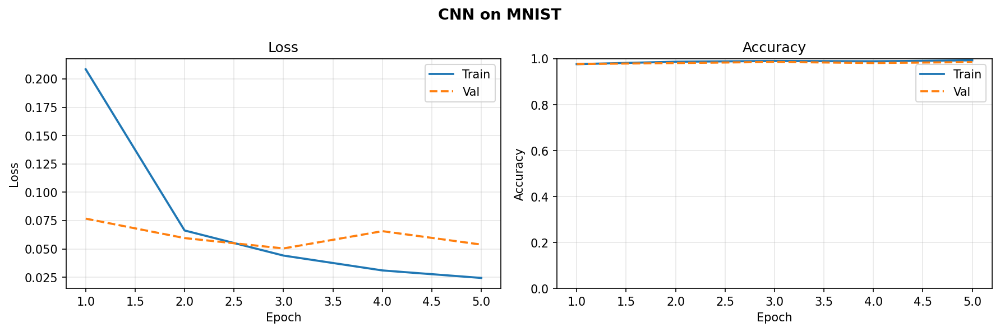
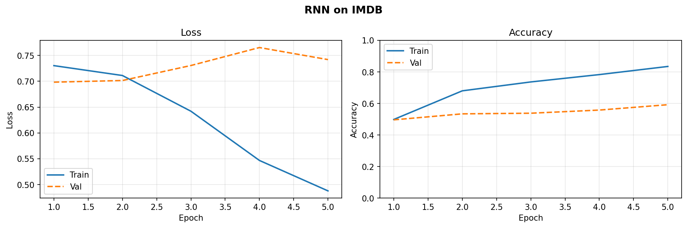
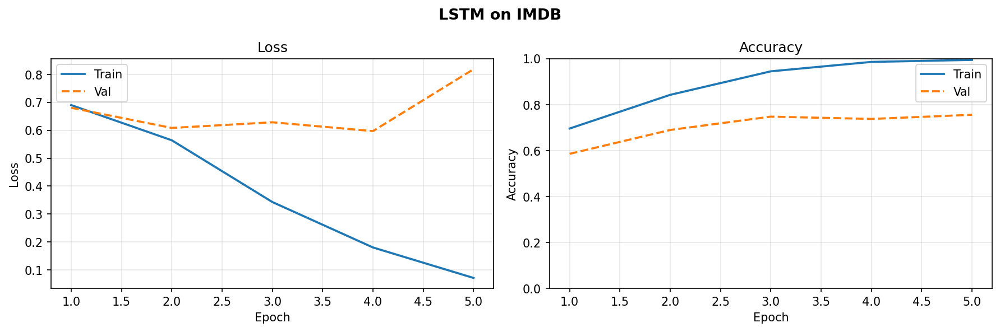
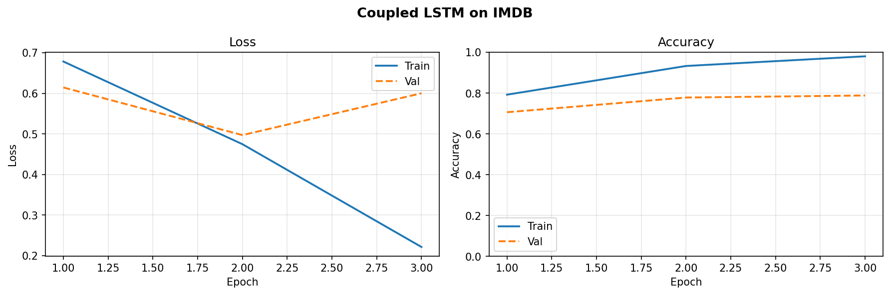

# Deep Learning From Scratch

A modular deep learning framework implemented entirely in **NumPy**, built to understand how modern neural network architectures and training algorithms work under the hood, without relying on high-level deep learning libraries.

## Highlights

- Implemented from scratch using NumPy
- Modular layer-based framework
- Reusable training pipeline
- Multiple neural architectures
- Complete forward and backward propagation for every component

## Architectures

- Multi-Layer Perceptron (MLP)
- Convolutional Neural Network (CNN)
- Vanilla Recurrent Neural Network (RNN)
- Long Short-Term Memory (LSTM)
- Coupled Input-Forget Gate LSTM

### Implemented Components

- Dense Layers
- Convolution Layers
- Pooling Layers
- Flatten Layers
- Sequential Containers
- SGD Optimizer
- Adam Optimizer
- Cross Entropy Loss
- Binary Cross Entropy Loss
- Xavier Initialization
- He Initialization
- L1/L2 Regularization
- Early Stopping

## Repository Structure

```text
deep-learning-from-scratch/
│
├── configs/
├── docs/
├── notebooks/
├── src/
│   ├── datasets/
│   ├── layers/
│   ├── models/
│   ├── modules/
│   ├── training/
│   └── utils/
└── tests/
```

## Example Usage

```python
model = MLP(
    layer_sizes=[784, 128, 64, 10],
    activations=["relu", "relu", "linear"]
)

trainer = Trainer(model=model, epochs=20, batch_size=32)

history = trainer.fit(
    X_train,
    y_train,
    X_val,
    y_val
)
```

See `notebooks/deep_learning_demo.ipynb` for a full walkthrough of every architecture.

## Results

| Architecture | Dataset | Test Accuracy |
| ------------ | ------- | -------------- |
| MLP          | MNIST   | 97.94          |
| CNN          | MNIST   | 98.24          |

### Sequence models

| Architecture  | Synthetic Sequence | IMDB Test  |
| ------------- | ------------------: | ---------: |
| RNN           |              100.0% |     57.44% |
| LSTM          |              100.0% |     74.80% |
| Coupled LSTM  |              100.0% | **85.52%** |

### Training curves

 

 



All curves are generated in [`notebooks/deep_learning_demo.ipynb`](notebooks/deep_learning_demo.ipynb) and saved to `assets/`. More detail on each run is in [`docs/results.md`](docs/results.md) and [`docs/experiments.md`](docs/experiments.md).

## Installation

```bash
git clone <repo>

cd deep-learning-from-scratch

pip install -r requirements.txt
```

Datasets aren't included in the repo — see [`data/README.md`](data/README.md) for download instructions.

## Running Experiments

```bash
jupyter notebook notebooks/deep_learning_demo.ipynb
```

or

```python
from src.models import MLP
```

## Running Tests

```bash
python tests/run_tests.py
```

## Future Improvements

- Batch Normalization
- Dropout
- Transformer Architectures